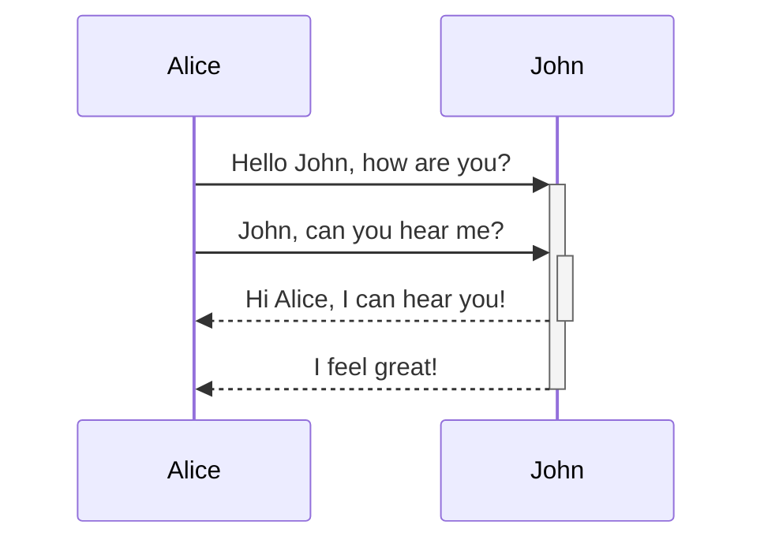

```dataviewjs
const today = DateTime.now()
const endOfYear = {
    year: today.year,
    month: 12,
    day: 31
}

const lifespan = { year: 80 } 
const birthday = DateTime.fromObject({
    year: 2005,
    month: 2,
    day: 6
});
const deathday = birthday.plus(lifespan)

function progress(type) {
    let value;
    
    switch(type) {
        case "lifespan": 
            value = (today.year - birthday.year) / lifespan.year * 100;
            break;
        case "year":
            value = today.month / 12 * 100
            break;
        case "month":
            value = today.day / today.daysInMonth * 100
            break;
        case "day":
            value = today.hour / 24 * 100
            break;
    }
    return `<progress value="${parseInt(value)}" max="100"></progress> | ${parseInt(value)} %`
}


dv.span(`
|  | Прогресс  | Процент |
| --- | --- |:---:|
| **Год** | ${progress("year")}
| **Месяц**| ${progress("month")}
| **День**| ${progress("day")}
| **Жизнь** | ${progress("lifespan")}
`)
```


```dataview
table length(rows.file.name) as "Прочитано"
from "Education/Book/2024"
where isRead = "yes"
```


